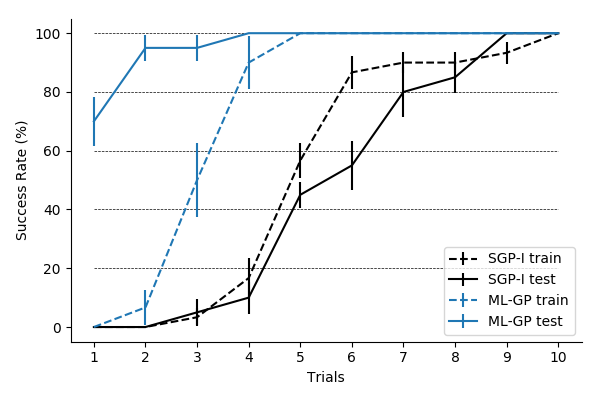
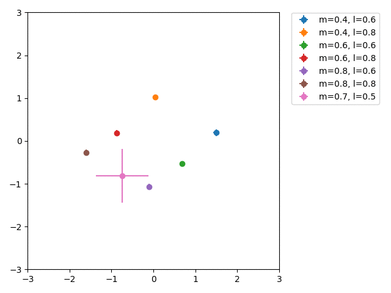

### [Meta Reinforcement Learning with Latent Variable Gaussian Processes](https://arxiv.org/abs/1803.07551)

### Description
Implementation for Meta Reinforcement Learning with Latent Variable Gaussian Processes. Includes implementation of:

* [PILCO](http://mlg.eng.cam.ac.uk/pilco/) with (variational) sparse Gaussian Processes using [GPflow](https://github.com/GPflow/GPflow)
* Latent Variable Gaussian Process model for meta learning
* Cartpole Swingup task from paper (**Note:** requires [DartEnv](https://github.com/DartEnv/dart-env))
* Pendulum task from [OpenAI Gym](https://github.com/openai/gym)

See [paper](https://arxiv.org/abs/1803.07551) for details.

### Core requirements:

* Tensorflow (v1.12.0)
* GPflow (v1.3.0)
* OpenAI gym (v0.10.8)
* (Optional) DartEnv

See requirements.txt for other dependencies.

#### Cartpole Swingup
##### Success Rate vs. Number of Trials



**Figure 1:** Average success rate across training and test sets / trial (SGP-I: Independent training / ML-GP: Meta learning model). The ML-GP model solves 3/4 test tasks in the first trial.

##### Latent Task Embedding


**Figure 2:** Live inference of latent task variable for test tasks. Each frame corresponds to one additional observation from a previously unseen task. Labels indicate mass and length of the pendulum in the cartpole swingup tasks.

### Run example

```
python run_pilco.py \
  --env=PendulumEnv \
  --seed=1 \
  --model_name=MLSVGP \
  --episode_length=50 \
  --planning_horizon=10 \
  **kwargs (see file)
```
